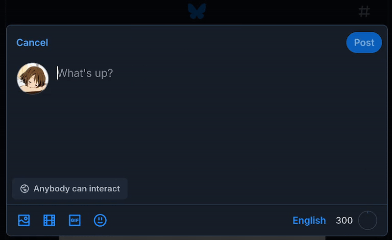

# Bluesky Emoji

This is a browser extension that adds Discord-style emoji completion to Bluesky.

Links:

- [Chrome Web Store](https://chromewebstore.google.com/detail/bluesky-emoji/balijppaamjmdlgeliadigmagncoamaa)
- [Firefox Add-ons](https://addons.mozilla.org/en-US/firefox/addon/bluesky-emoji)

## Small note

In case you're curious about the collection of available emoji and their names, I published it as a separate repo with a description of how I generated it! Link [here](https://github.com/yui019/emoji-names/).

## Icon

The icon I chose for this extension is the [Twemoji 15.0.3 butterfly emoji 🦋](https://emojipedia.org/twitter/twemoji-15.0.3/butterfly). I thought it was pretty fitting, and it looks nice as well.
